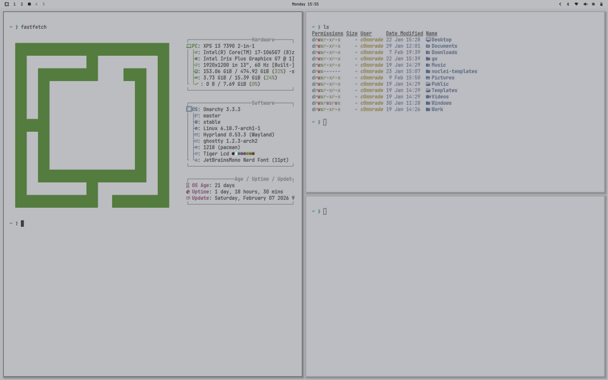

# Tiger LCD

A retro LCD-inspired light theme for [Omarchy](https://omarchy.com). Cool silver backgrounds, desaturated colors, and optional LCD text shadows that mimic Tiger Electronics handheld games.



## Install

```bash
omarchy-theme-install https://github.com/thec0mmrade/omarchy-tiger-lcd
```

Then apply:

```bash
omarchy-theme-set tiger-lcd
```

## Optional Extras

The theme includes optional LCD shadow effects for Ghostty terminal and libadwaita color overrides. These live outside the omarchy theme system and must be installed separately.

```bash
./extras/setup-lcd-extras.sh
```

This will:
- Install the **Departure Mono Nerd Font** and set it as the system font via `omarchy-font-set`
- Copy the GLSL drop-shadow shader to `~/.config/ghostty/`
- Replace any existing `custom-shader` lines in your Ghostty config with the LCD shader
- Install libadwaita color overrides to `~/.config/gtk-4.0/gtk.css` (backs up any existing file)

### Removing extras

When switching to a different theme, remove the extras manually:

```bash
rm ~/.local/share/fonts/DepartureMonoNerdFont*.otf && fc-cache -f
omarchy-font-set <your-preferred-font>
rm ~/.config/ghostty/lcd-shadow.glsl
rm ~/.config/gtk-4.0/gtk.css
```

And remove these lines from `~/.config/ghostty/config`:

```
custom-shader = ~/.config/ghostty/lcd-shadow.glsl
custom-shader-animation = false
```

## Color Palette

| Role         | Hex       | Preview |
|--------------|-----------|---------|
| Background   | `#BCBDC1` |  |
| Foreground   | `#2A2B26` |  |
| Accent       | `#626870` |  |
| Black        | `#2A2B26` |  |
| Red          | `#7A3328` |  |
| Green        | `#4F7A3A` |  |
| Yellow       | `#8B7A30` |  |
| Blue         | `#4A6080` |  |
| Magenta      | `#804A6E` |  |
| Cyan         | `#3A7A72` |  |
| White        | `#E1E2E7` |  |
| Bright Black | `#666870` |  |
| Bright Red   | `#943D2E` |  |
| Bright Green | `#608A48` |  |
| Bright Yellow| `#A08A40` |  |
| Bright Blue  | `#587090` |  |
| Bright Magenta| `#905880`|  |
| Bright Cyan  | `#488A82` |  |
| Bright White | `#EDEEF3` |  |

## License

MIT
